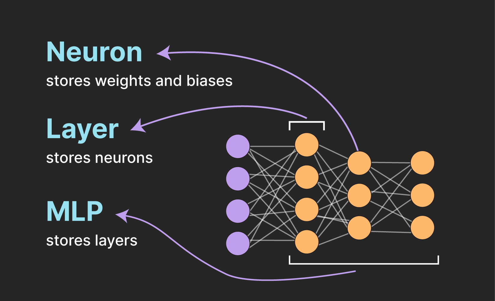
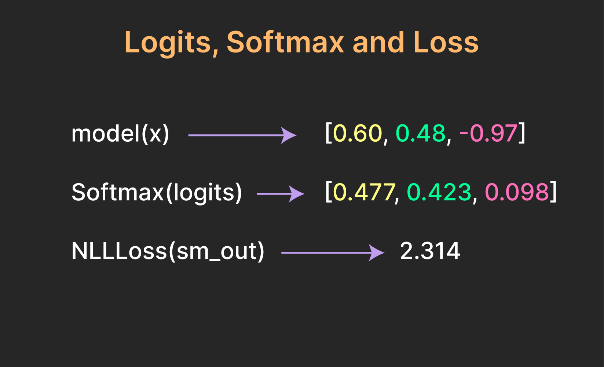
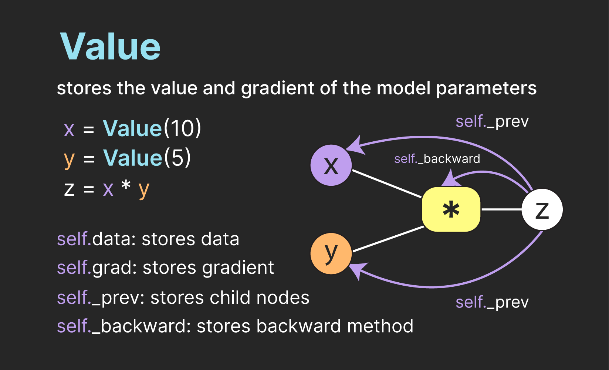
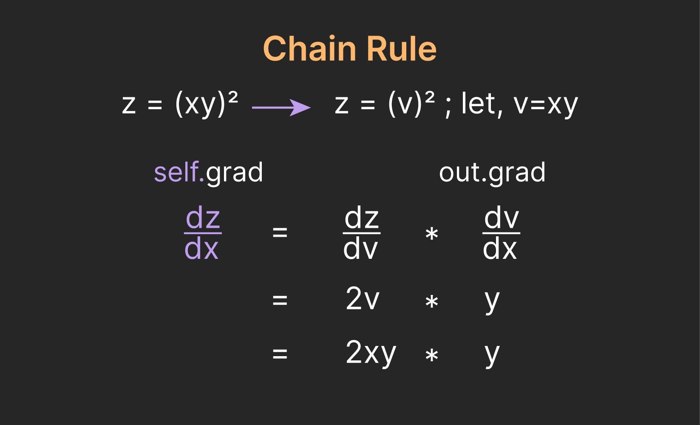

# Micrograd for Classification

[-red)](https://www.youtube.com/watch?v=a11WEgcEIvc&t=60s)

This project is a modification of Andrej Karpathy's micrograd, adapted for multiclass classification tasks. It demonstrates how to build a Multilayer Perceptron (MLP) from scratch in Python. 

## Multilayer Perceptron (MLP)

The MLP is a type of artificial neural network composed of multiple layers of neurons (or nodes). Each neuron in one layer connects with a certain weight to every neuron in the following layer.

The network can be built using the following classes:

- `Neuron`: Represents a single neuron in the network. Each neuron has a set of weights and a bias, which are initialized randomly.

- `Layer`: Represents a layer of neurons in the network. It initializes the neurons and calculates the output of each neuron in the layer.

- `MLP`: Represents the entire network. It initializes the layers of the network and implements the forward pass of the network. It also includes a `zero_grad` method, which resets the gradients of the parameters to zero.

## Loss Calculation

The loss is calculated from the model outputs (logits) using CrossEntropyLoss, which is a combination of Softmax and NLLLoss.

## Gradient Calculation

To calculate the gradient of the loss with respect to the model parameters, the `Value` class is used.

The `Value` class uses the chain rule to find gradients using the `_backward` method.

